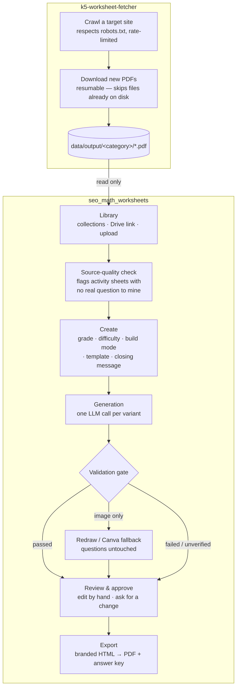
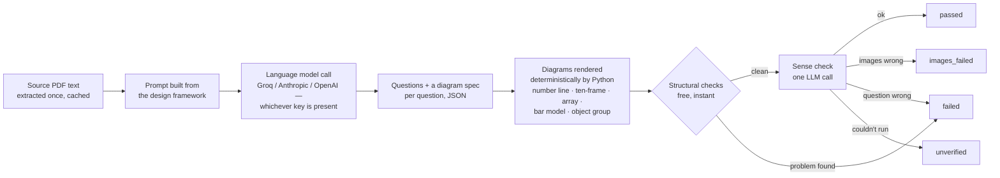
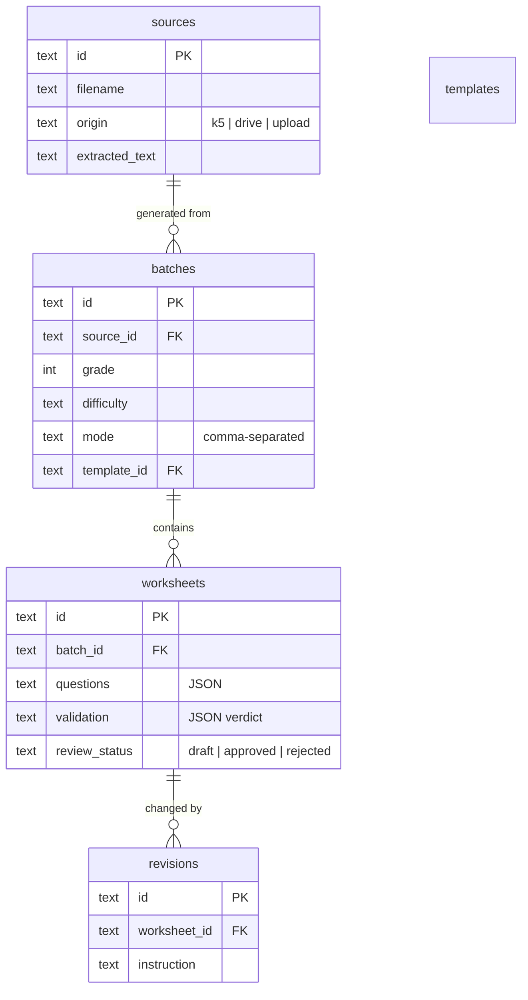

# Architecture — SEO Math Worksheets

Two independent components. The first fetches source material; the
second turns it into new, validated worksheets. Neither knows anything
about the other's internals — they connect through one folder of PDFs
on disk.

```
SEO_Worksheets/
├── k5-worksheet-fetcher/     component 1 — acquisition
└── seo_math_worksheets/      component 2 — generation, validation, review
```

---

## 1. System overview



The fetcher never runs inside the tool's process and the tool never
crawls anything itself — the only connection is `seo_math_worksheets`
reading `k5-worksheet-fetcher/data/output/` as one of its three source
routes (the other two are a Drive link and a direct upload).

---

## 2. Generation pipeline, in detail



**Provider selection is automatic**, in `app/config.py`: the first key
present wins, in the order Groq → Anthropic → OpenAI. With none set, a
clearly-labelled sample provider lets every screen be exercised without
spending anything. Every provider is called through one interface
(`app/providers/llm.py`), so adding a fourth provider or moving to a
paid tier touches one file, not the whole pipeline.

**Diagrams are drawn, not generated**, for the same reason a diffusion
model is never asked to place exactly 7 counters: it produces something
that *looks* plausible and can be arithmetically wrong, and it succeeds
silently. The model instead emits a structured spec
(`{"kind": "ten_frame", "filled": 7}`) and `app/providers/images.py`
renders it with matplotlib — correct by construction. An image API
(OpenAI) is available separately, for decorative artwork only.

**Validation is not optional.** It runs on every variant, before a
human ever sees it, and produces one of four verdicts:

| Verdict | Meaning | What happens next |
|---|---|---|
| `passed` | Structure and content both check out | Straight to Review |
| `images_failed` | Questions are fine, a picture isn't (including a picture that gives away its own answer) | Redrawn automatically — Canva second, if configured. Questions are never touched. |
| `failed` | A question itself is wrong, incomplete, or duplicated | Shown to the reviewer with the specific reason |
| `unverified` | The sense check could not run (quota, network) | Never silently treated as a pass |

---

## 3. Data model



One SQLite file (`data/studio.db`). No ORM — the whole schema is
readable in `app/db.py` in one screen. `sources.id` is protected by a
foreign key from `batches`, so removing a source that has generated
work asks for confirmation (and offers to remove the dependent
worksheets too) rather than either silently failing or corrupting data.

---

## 4. Where a new key or provider plugs in

| To add | Touch this file | Nothing else changes |
|---|---|---|
| A new key (Groq/Anthropic/OpenAI) | `seo_math_worksheets/.env` | Auto-detected on restart |
| A different text provider | `app/providers/llm.py` — one `_yourprovider()` function + one line in `_PROVIDERS` | Generation, validation, everything above stays the same |
| Canva | `.env` (3 values) **plus** clicking "Connect Canva" in the Setup tab | Needs a **Canva Enterprise** plan — see §5. This is OAuth (a person approves it once), not a key you just paste in. |
| A new diagram kind | `app/providers/images.py` — one render function + one line in `_RENDERERS`, plus telling the model about it in `DIAGRAM_SPEC_INSTRUCTIONS` | Validation's answer-reveal check and the sense-checker's picture description both generalise automatically |
| A new source website | A new module beside `k5-worksheet-fetcher/`, plus a new branch in `app/ingest.py`'s three-route dispatch | The generation and validation pipeline never sees where a PDF came from |

---

## 5. Canva — the important caveat

Canva's Autofill API (the piece that would place a picture into a
branded template) **requires a Canva Enterprise plan**. This is Canva's
own restriction, stated in their documentation, not a limitation of
this codebase — a Free, Pro, or Teams Canva plan cannot use it at all,
regardless of what credentials are configured.

The connection is also **OAuth 2.0 with PKCE**, not a static API key: a
real person with a Canva account logs into Canva's Developer Portal
(MFA required), creates an integration, and then approves the
connection once from the app's Setup tab. `app/providers/canva.py`
implements the full flow — the authorization redirect, the callback,
encrypted token storage with automatic refresh, and the real
upload → autofill → export job sequence (each of those three steps is
an asynchronous job that must be polled, not a single request/response).

One implementation detail is flagged in the code as unconfirmed against
Canva's live API: the exact shape of the `Asset-Upload-Metadata` header
sent when uploading an image. It's implemented against the best
available documentation but hasn't been exercised against a real
connection — see the comment at that line in `canva.py` if an upload
ever fails with a 400.

## 6. What is deliberately not built yet

- **Publishing an approved worksheet to the live site** — the pipeline
  stops at "approved and downloadable"; where it goes after that is a
  team decision, not a technical one.
- **A real worksheet template driving the exported layout** — templates
  can be uploaded and tagged by grade today, but the export still uses
  one house style regardless of which template is picked.
